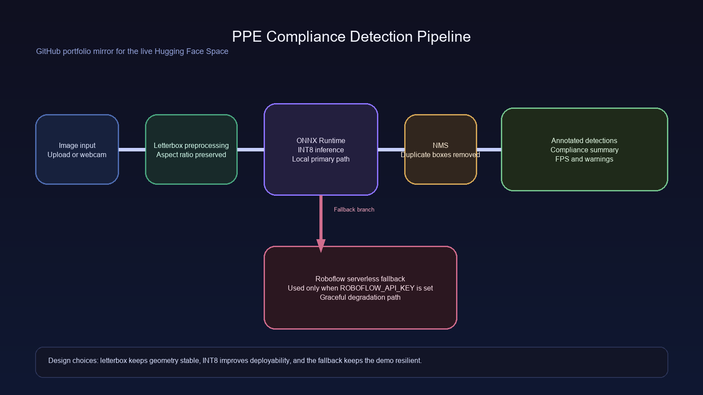
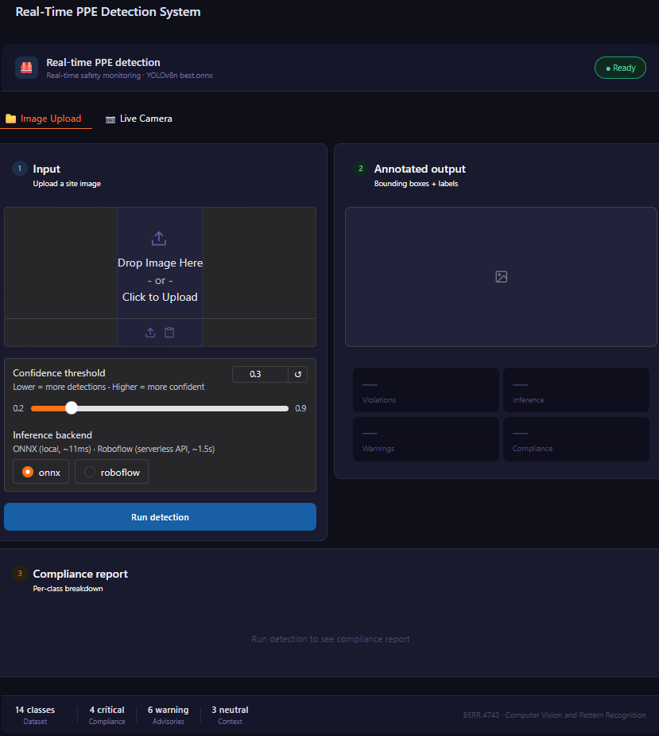
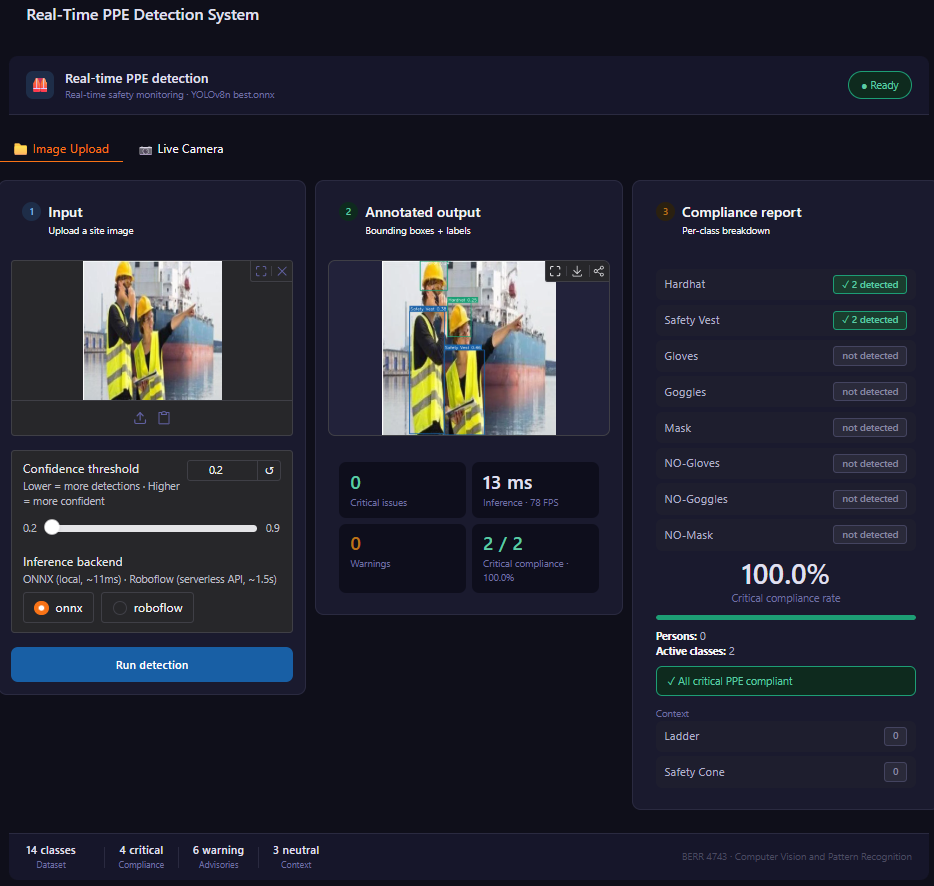

# PPE Compliance Detection System

[](https://github.com/JeffYeo0406/PPE-Compliance-Detection-System/actions/workflows/ci.yml)

Real-time 14-class PPE compliance detection with a YOLOv8n backbone, INT8 ONNX deployment, and a dual-backend inference path for resilience.

Live demo: https://jeffyeo-cvpr-ppe-demo.hf.space/

Source mirror: https://github.com/JeffYeo0406/PPE-Compliance-Detection-System.git

## Results

| Metric | Value |
|---|---|
| mAP@50 | 0.776 |
| mAP@50-95 | 0.491 |
| Precision | 0.704 |
| Recall | 0.812 |
| Model | YOLOv8n -> INT8 ONNX |
| Classes | 14 |
| Deployment | Local ONNX primary, Roboflow fallback |

| Model | Size | CPU latency | FPS |
|---|---:|---:|---:|
| PyTorch .pt | 6.0 MB | 10.2 ms | 97.8 |
| FP32 ONNX | 11.59 MB | 7.5 ms | 133.9 |
| INT8 ONNX | 3.17 MB | 20.8 ms | 48.0 |

The INT8 export is the deployment artifact used for the public mirror and is 3.66x smaller than the FP32 export.

## Architecture



Pipeline summary:
- Image input is letterbox-resized to preserve aspect ratio.
- ONNX Runtime runs the INT8 model on CPU or CUDA when available.
- NMS removes duplicate detections before rendering.
- If `ROBOFLOW_API_KEY` is set, the app can fall back to Roboflow serverless inference.

Design decisions:
- Letterbox preprocessing avoids the distortion that comes from naive stretch-resize.
- INT8 quantization reduces the deployment footprint for CPU-only Spaces while preserving practical detection quality.
- The dual-backend path makes the app degrade gracefully instead of failing outright if local inference is unavailable.

## Class Tiers

| Tier | Classes |
|---|---|
| Critical | Hardhat, Safety Vest, NO-Hardhat, NO-Safety Vest |
| Warning | Gloves, Goggles, Mask, NO-Gloves, NO-Goggles, NO-Mask |
| Emergency | Fall-Detected |
| Neutral | Person, Ladder, Safety Cone |

## Demo





## Repository Structure

| Path | Purpose |
|---|---|
| [app.py](app.py) | Gradio UI and event wiring |
| [inference.py](inference.py) | ONNX inference, preprocessing, and postprocessing |
| [utils.py](utils.py) | Drawing and compliance-report helpers |
| [roboflow_inference.py](roboflow_inference.py) | Optional serverless fallback backend |
| [models/best_int8.onnx](models/best_int8.onnx) | Primary deployment artifact |
| [training/training_notes.md](training/training_notes.md) | Dataset and training summary |
| [training/training_config.yaml](training/training_config.yaml) | Final training/export configuration |
| [docs/architecture.png](docs/architecture.png) | Pipeline diagram |
| [docs/demo_screenshot.png](docs/demo_screenshot.png) | Portfolio preview image |
| [docs/demo_screenshot_detection.png](docs/demo_screenshot_detection.png) | Annotated inference example |
| [.github/workflows/ci.yml](.github/workflows/ci.yml) | Lightweight CI validation |

## Run Locally

```bash
python -m venv .venv
.venv\Scripts\activate
pip install -r requirements.txt
python app.py
```

Open http://localhost:7860 after the server starts.

## Training Notes

See [training/training_notes.md](training/training_notes.md) for the dataset source, split sizes, model settings, and evaluation summary.

## License

MIT License. See [LICENSE](LICENSE) for the full text.